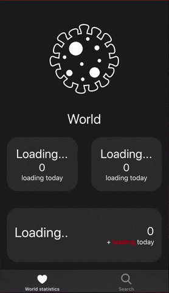

  
 
  
  
  

# CoronavirusStatistics
iOS application that gets the latest coronavirus statistics built with Swift & UIKit.
The data was provided by [this](https://rapidapi.com/api-sports/api/covid-193) API.

## Installation
To install Coronavirus Statistics just clone the `master` branch, change the API key and build the project yourself.

## Demo

  
 

## License
CoronavirusStatistics is available under the MIT license, see the [LICENSE](LICENSE) file for more information.
